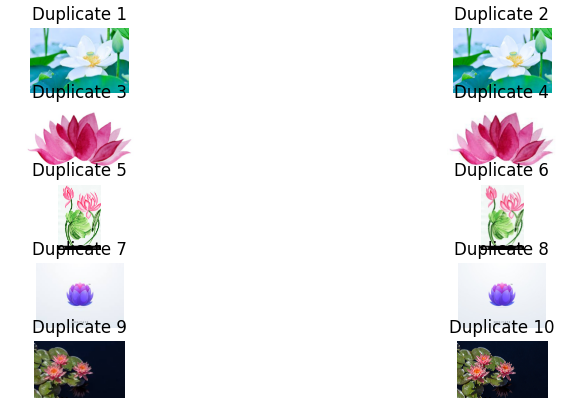

# Image Duplicate Finder
Finds duplicates of images.



## Table of Contents
- [Technologies](#technologies)
- [Getting Started](#getting-started)
- [Running](#running)
- [About The Project](#about-the-project)

## Technologies
- [PIL](https://pypi.org/project/pillow/)
- [matplotlib](https://matplotlib.org/)
- [imagehash](https://pypi.org/project/ImageHash/)
- [multiprocessing](https://docs.python.org/3/library/multiprocessing.html)

## Getting Started

### Installation
You should install additional libraries like:
- PIL
- matplotlib
- imagehash

Using following command:
```
pip install -r requirements.txt
```

### Preparation
- Place a folder with your images in the project directory (where main.py is located).
- Change the folder name(s) in main.py:
```
folders = [
        os.path.join("5 Flower Types Classification Dataset", "Lilly"),
        os.path.join("5 Flower Types Classification Dataset", "Lotus"),
        os.path.join("5 Flower Types Classification Dataset", "Orchid"),
        os.path.join("5 Flower Types Classification Dataset", "Sunflower"),
    ]
```


## Running
Navigate to the project directory and run the following command:

```
python main.py
```


## About The Project
This program allows you to find duplicate images using imagehash.
